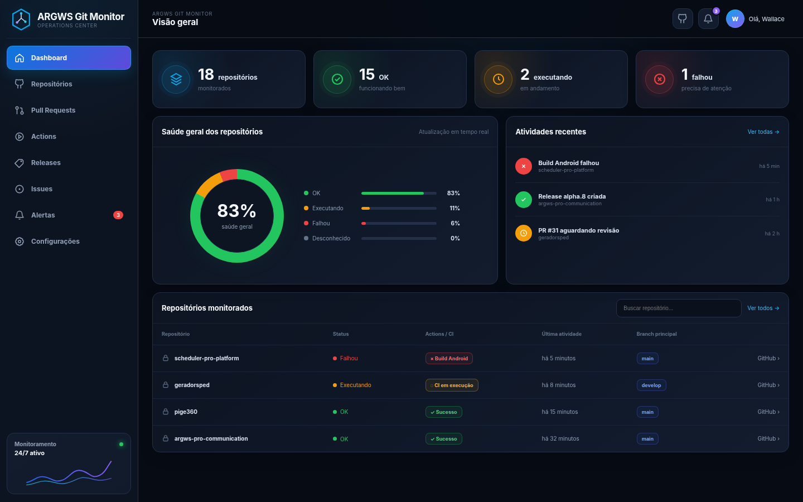
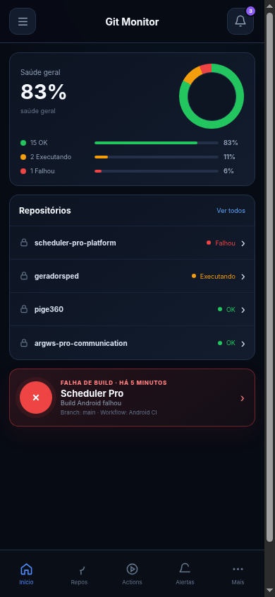

# ARGWS Git Monitor

Central operacional **mobile-first** para monitorar repositórios públicos e privados do GitHub em uma única PWA. O projeto inclui API, frontend, workers, PostgreSQL, Redis, RabbitMQ, migrations, autenticação, Docker, CI/CD, backup, GitHub Release e imagens no GHCR.

## Recursos entregues

- Dashboard operacional no padrão visual aprovado, com quatro indicadores, saúde segmentada, atividades recentes e tabela compacta.
- Navegação própria para Repositórios, Pull Requests, Actions, Releases, Issues, Alertas e Configurações.
- Experiência mobile-first com navegação inferior, painel “Mais” e alerta crítico de build.
- Repositórios públicos e privados por token GitHub granular.
- Último commit, branch principal, branches, issues, pull requests, releases e Actions.
- Histórico de execuções, PRs e releases por repositório.
- Reexecução completa, reexecução somente de jobs com falha e cancelamento de workflow.
- Sincronização automática, manual e por webhook.
- PWA instalável em celular, tablet e desktop.
- Interface responsiva, tema claro/escuro e comportamento offline.
- Token GitHub criptografado no PostgreSQL e nunca devolvido ao navegador.
- JWT de curta duração, refresh token rotativo/revogável, Argon2 e troca obrigatória da senha inicial.
- Logs estruturados, health checks, métricas Prometheus, backup e restauração.

## Interface visual

A interface aprovada na versão 0.2.0 permanece como contrato visual da série 0.2.x.





Os critérios, rotas, componentes e larguras de aceitação estão documentados em `docs/CONTRATO_VISUAL.md`.

## Instalação direta

Os instaladores usam as imagens prontas do GHCR por padrão. Caso o pull não esteja disponível, realizam automaticamente o build local com o código-fonte.

### Windows

1. Extraia o pacote da GitHub Release.
2. Abra o Docker Desktop.
3. Execute `INSTALAR_WINDOWS.bat`.
4. Acesse `http://localhost:8080`.
5. Consulte `CREDENCIAIS_INICIAIS.txt`.

### Linux

```bash
chmod +x INSTALAR_LINUX.sh
./INSTALAR_LINUX.sh
```

### GHCR manual

Gere o `.env` seguro. Não copie `.env.example` sobre o `.env` gerado:

```bash
./scripts/generate-env.sh
```

Depois, baixe e execute as imagens:

```bash
docker compose -f compose.yaml -f compose.ghcr.yaml pull
docker compose -f compose.yaml -f compose.ghcr.yaml up -d --no-build --remove-orphans
```

Também existe uma stack autônoma para Dockge e Portainer:

```bash
docker compose -f compose.dockge.yaml pull
docker compose -f compose.dockge.yaml up -d --no-build --remove-orphans
```

### Build Docker local

```bash
./scripts/generate-env.sh
docker compose -f compose.yaml up -d --build --remove-orphans
```

Para forçar permanentemente o modo local, configure no `.env`:

```dotenv
INSTALL_SOURCE=local
IMAGE_TAG=local
```

A instalação aplica migrations, cria o administrador, inicializa workers e aguarda a prontidão da API. Não é necessário instalar Python, Node.js, PostgreSQL, Redis ou RabbitMQ diretamente no host.

## Imagens Docker

Imagens publicadas pelo workflow `Release e GHCR`:

```text
ghcr.io/wkarts/argws-git-monitor-api
ghcr.io/wkarts/argws-git-monitor-web
```

Tags produzidas para esta versão:

```text
latest
sha-<commit>
0.2.1
0.2
```

Exemplo de pull versionado:

```bash
docker pull ghcr.io/wkarts/argws-git-monitor-api:0.2.1
docker pull ghcr.io/wkarts/argws-git-monitor-web:0.2.1
```

Pacotes GHCR privados exigem autenticação antes do pull:

```bash
echo "$GHCR_TOKEN" | docker login ghcr.io -u wkarts --password-stdin
```

## Primeiro acesso e GitHub

1. Entre com as credenciais geradas no pacote.
2. Troque a senha administrativa.
3. Abra **Configurações > Nova conexão**.
4. Cadastre um token fine-grained do GitHub.
5. Importe todos os repositórios autorizados ou selecione-os manualmente.

Permissões recomendadas:

| Permissão de repositório | Somente monitorar | Operar Actions/webhooks |
|---|---:|---:|
| Metadata | leitura | leitura |
| Contents | leitura | leitura |
| Actions | leitura | escrita |
| Pull requests | leitura | leitura |
| Issues | leitura | leitura |
| Webhooks | nenhuma | escrita |

## Serviços Docker

| Serviço | Papel |
|---|---|
| `web` | Vue 3 PWA servida por Nginx e proxy reverso da API |
| `api` | FastAPI e OpenAPI |
| `worker` | Celery para sincronizações e processamento assíncrono |
| `beat` | Agendador periódico do Celery |
| `migrate` | Alembic e bootstrap idempotente |
| `postgres` | Persistência principal |
| `redis` | Resultados e cache operacional |
| `rabbitmq` | Broker das filas |

Portas locais:

- Aplicação: `8080`.
- RabbitMQ Management: `127.0.0.1:15672`.
- PostgreSQL, Redis e AMQP não são publicados no host.

## Comandos operacionais

```bash
./scripts/start.sh
./scripts/stop.sh
./scripts/status.sh
./scripts/logs.sh
./scripts/backup.sh
./scripts/restore.sh backups/arquivo.dump
./scripts/update.sh
```

## Produção com domínio

```bash
./scripts/configure-domain.sh https://git.seu-dominio.com.br
```

Depois, aponte o proxy HTTPS para `http://127.0.0.1:8080`. Para webhooks automáticos, `PUBLIC_BASE_URL` precisa ser pública e HTTPS.

## CI/CD e versionamento

A versão deve permanecer idêntica em:

```text
VERSION
backend/pyproject.toml
frontend/package.json
```

Ao receber um push na `main`, o workflow:

1. valida backend, frontend, pacote e Docker Compose;
2. constrói as imagens API e Web para `linux/amd64` e `linux/arm64`;
3. publica e inspeciona os manifests no GHCR;
4. atualiza as tags `latest` e `sha-*`;
5. quando a tag Git da versão ainda não existe, cria `v<versão>`;
6. publica a GitHub Release com ZIP, TAR.GZ e `SHA256SUMS.txt`.

Versão atual: **0.2.1**. Git tag da release: **v0.2.1**. A tag da imagem Docker é **0.2.1**, sem o prefixo `v`.

Atualizações automáticas de versão do Dependabot estão desativadas para impedir a abertura massiva de PRs. As dependências devem ser atualizadas em manutenção planejada, com validação pela CI.

## Documentação

- `docs/ARQUITETURA.md`
- `docs/GITHUB.md`
- `docs/OPERACAO.md`
- `docs/SEGURANCA.md`
- `docs/CONTRATO_VISUAL.md`
- `docs/DEPLOY_CLOUDPANEL_DOCKGE.md`
- `RELATORIO_VALIDACAO.md`

## Desenvolvimento

```bash
docker compose -f compose.yaml -f compose.dev.yaml up -d --build
```

Backend:

```bash
cd backend
python -m venv .venv
. .venv/bin/activate
pip install -e '.[dev]'
pytest
```

Frontend:

```bash
cd frontend
npm install
npm run dev
npm run build
```

Validação completa:

```bash
python scripts/validate-package.py
node scripts/validate-frontend.cjs
cd backend && pytest --cov=app --cov-fail-under=40
```

## Licença

Software de uso autorizado. Consulte `LICENSE`.
